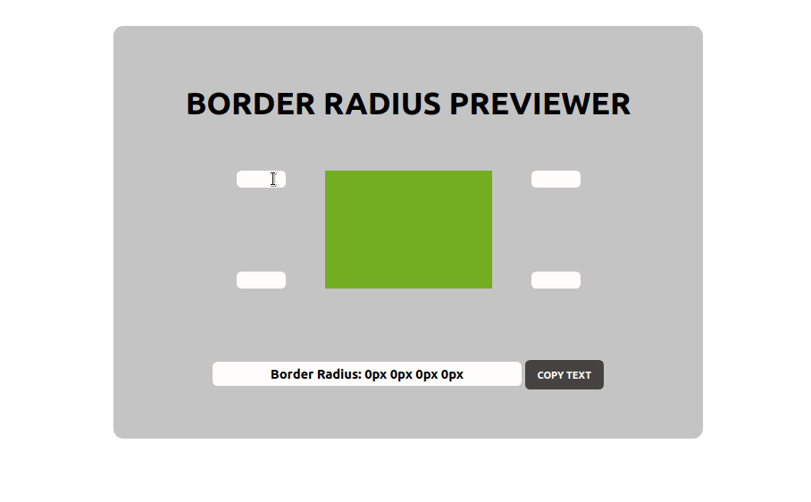

<h1 align="center">Border-Radius Previewer 🔵</h1>
<h1 align="center">
  
</h1>
Permite alterar o raio da borda de um elemento

## Funcionalidades
- [x] O usuário pode ver uma caixa que possui uma propriedade de raio da borda aplicada a ela.
- [x] O usuário pode alterar os 4 valores do raio da borda aplicados à caixa (canto superior esquerdo, canto superior direito, canto inferior esquerdo, canto inferior direito).
- [x] O usuário pode copiar o CSS resultante para a área de transferência.

## Autor
:bust_in_silhouette: Gabriel Henrique
- Twitter: [@GabrewHenrique](https://twitter.com/GabrewHenrique)
- Github: [@Gabriek0](https://github.com/Gabriek0)
- LinkedIn: [gabriel-henrique](https://www.linkedin.com/in/gabriel-henrique-664bb219a/)
---
